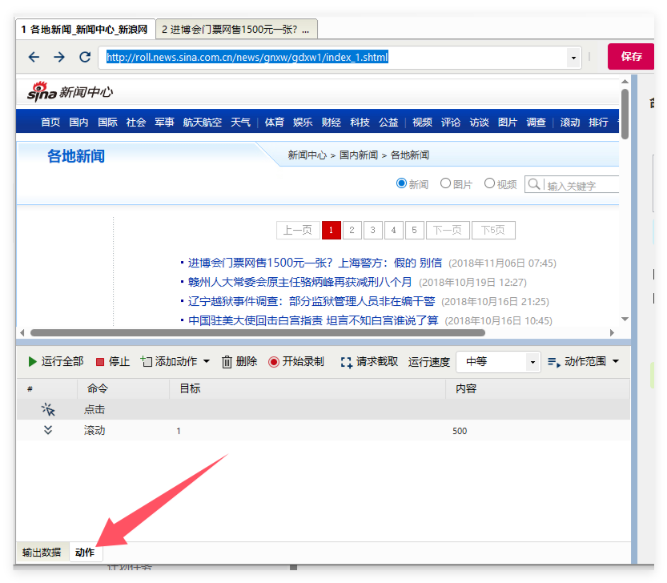
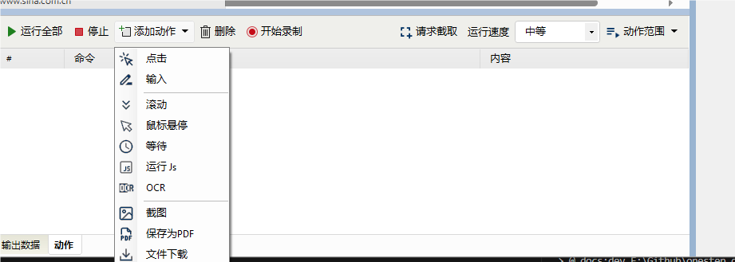
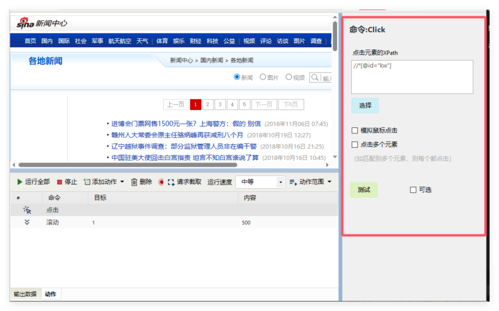
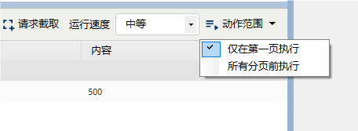
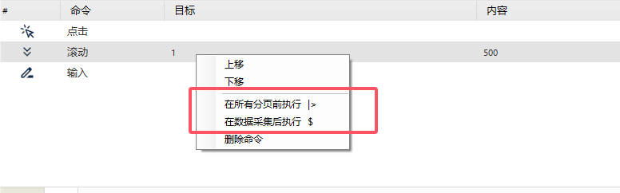

# 动作

这个功能主要针对一些单页应用（需要填写表单、点击等操作，URL不变），比如百度地图（ditu.baidu.com）,需要先输入查询关键词，在点击查询，才会出现结果数据。 还有其他一些需要输入筛选条件，比如时间、分类等条件的查询页面。

## 如何进入

在编辑器界面，底部，点击**动作**即可。 

编写脚本，十分简单，只要在浏览器中点击、输入即可。

**命令类型：**

1. **点击**， 鼠标点击命令
2. **输入**，对一些表单元素进行输入，比如文本框、下来列表、复选框等待
3. **鼠标悬停**，有些网页元素需要鼠标在指定位置悬停才会动态加载，鼠标移走就会消失。这种情况就使用 **鼠标悬停**
4. **等待**，等待指定长的时间
5. **滚动**，对于一些网页，需要滚动下拉，才能够采集或者其他操作
6. **运行 Js**，在网页中运行JavaScript 代码，能够执行复杂操作。可以运行JQuery
7. **清理 Cookie**，删除当前页面的Cookie，并且**重新加载页面**。

## 具体动作设置

**录制模式**

点击**开始录制** 按钮，会进入录制模式。在录制模式下，对浏览器点击、输入操作，都会自动生成相应的命令。 

## 动作范围

* 仅在第一页执行
* 所有分页前执行

**设置单条动作的执行时间点**

* 在所有分页前执行
* 在数据采集后执行

