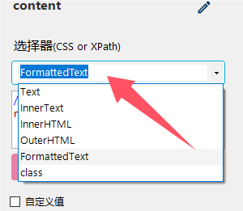
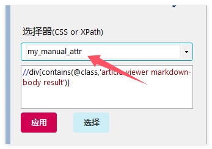

# 取值属性

首先，字段通过 **XPath/CSS** 定位查找到 Html 元素，然后我们就需要通过**取值属性** 来确定 Html 元素的哪个部分来作为字段值。

## 一般属性
一般情况下，采集器默认使用 *InnerText* 属性，以下是各个属性选项的详细介绍。

* **InnerText** 

    当前节点以及子节点的文本内容

* **Text** 

    表示当前节点的文本，不包含子节点的文本。

* **InnerHtml**

    表示当前节点内部的 `HTML` 内容（不包括当前节点）,一般用来获取文章正文，更好的还原原文格式。

* **OuterHtml**

    表示当前节点内部的 `HTML` 内容（包含当前节点）

* **FormattedText**

    经过格式化的`InnerText`。会移除掉多余的空格、换行，返回显示效果更好的文本。

## 特定元素属性

除了以上属性，在HTML中还是有一些特定元素的属性

* **href**，表示链接地址（A标签<a）
* **title**，表示标题
* **src**，一般表示图片地址（IMG标签<img）
* **class**，表示样式（css）
* **data-**，以`data-`开头的一些自定义数据属性，比如 data-src，data-id

## 手动输入属性

除了内置属性外，用户可以**手动填写 HTML 属性**。 

***特别提示：这里是可以手动输入属性名称，即使下拉选项中没有。比如常见的onclick、value、class。**

