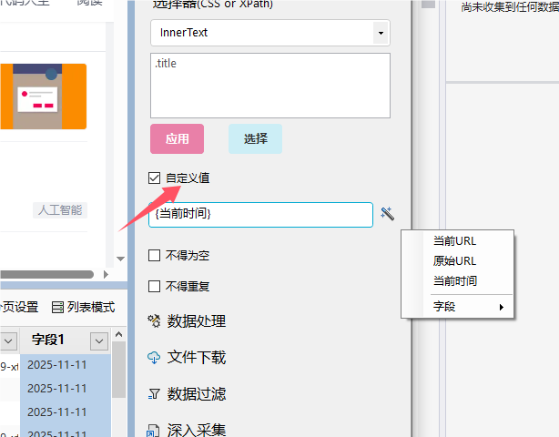

# 自定义数据

除了通过采集网页中的数据，程序还提供了*自定义数据* 

目前有3种类型的自定义数据：

1. **固定文本**，直接在文本框中输入固定字符即可。

2. **当前URL**，返回当前网页的地址。

2. **原始URL**，存在一些网址，在浏览器加载后会跳转到新的地址，**原始URL**则返回跳转前的URL。

3. **当前时间**，返回当前时间，格式为 `2011-01-01 00:00:00`。

4. **字段**，可以引用其他字段的值
    > 需要注意的是，只能引用当前字段 左侧，以及上一级页面字段的值。