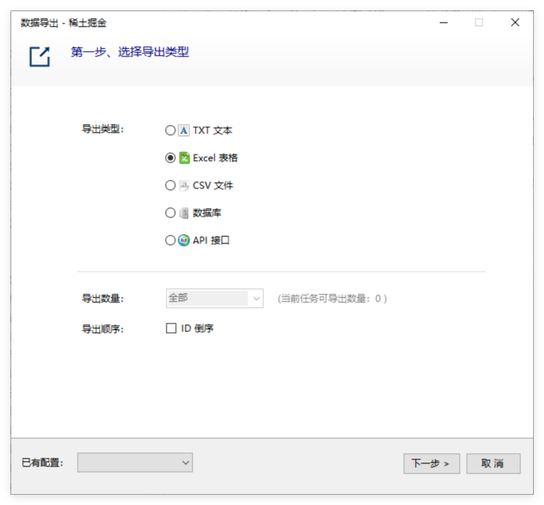
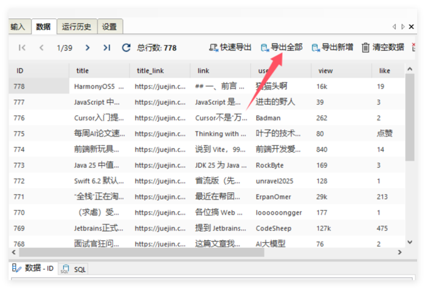

# 数据导出

爬山虎采集器支持多个格式的数据导出（发布），包括TXT、CSV、Excel、Access、MySQL、SQLServer、SQLite以及发布到网站接口（Api）。

导出方式有2种：

* 手动导出，通过`右击任务`-> `导出任务`，或者是在`数据`栏中导出。
* 自动导出，在编辑任务的设置导出。

在数据导出后，会被标记为*已导出*，在下次导出时，不会再导出。 如果想要导出全部数据，而不区分*已导出*，可以在`查看数据`中选择`导出全部`。

