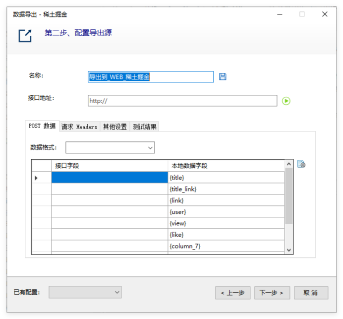

# 导出到网站接口（API）

支持主流CMS网站系统，比如Discuz、帝国CMS、Wordpress、DEDE CMS、PHP CMS，官方可以提供接口文件（API）。

对于开发人员，可以自己定义网站API，爬山虎采集器的通过HTTP POST请求将数据发送指定的API，设置对应的POST（application/x-www-form-urlencoded）参数、编码类型即可



POST示例参考   
```
POST http://www.example.com HTTP/1.1 
Content-Type: application/x-www-form-urlencoded;charset=utf-8 

title=example_title&content=example_content&channel=2

```