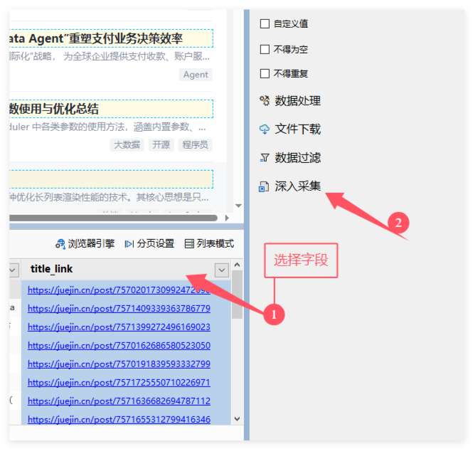
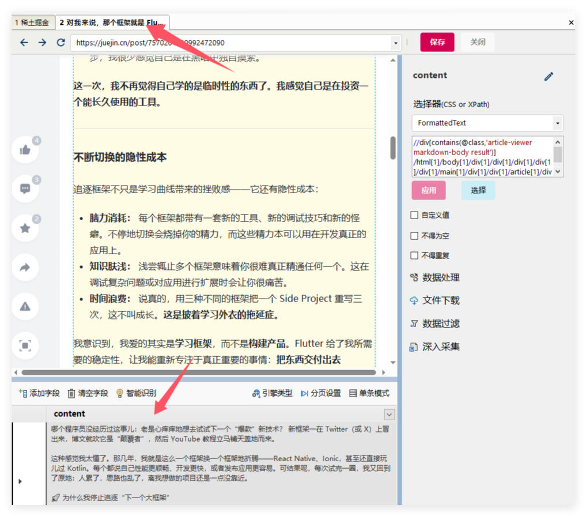
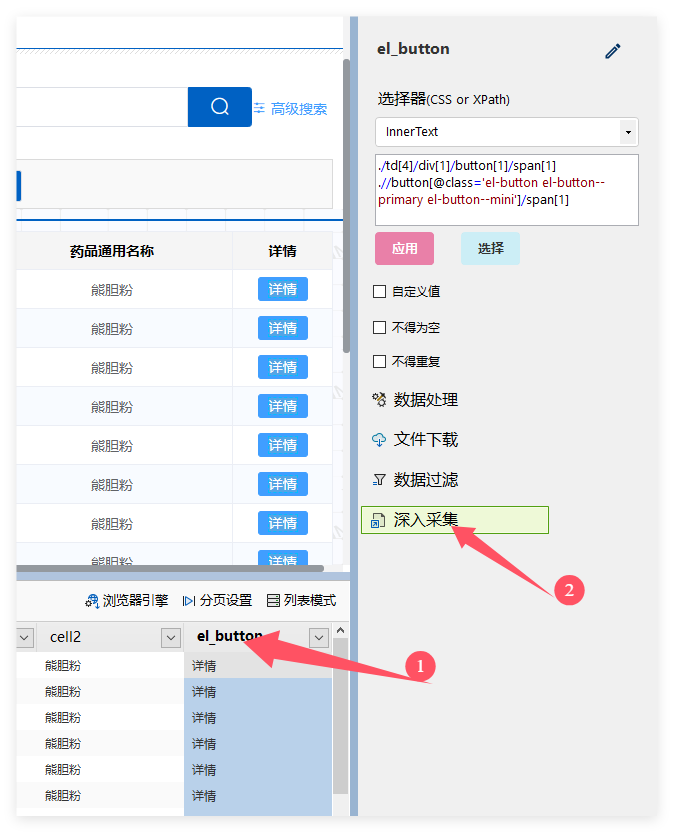
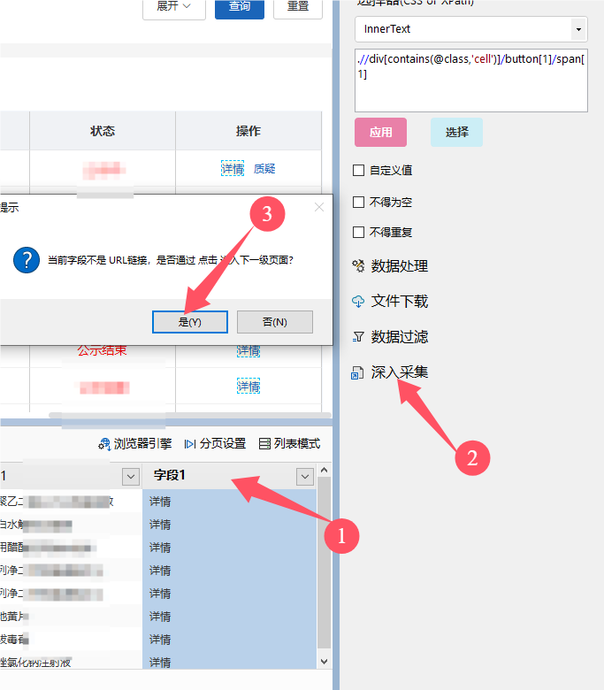
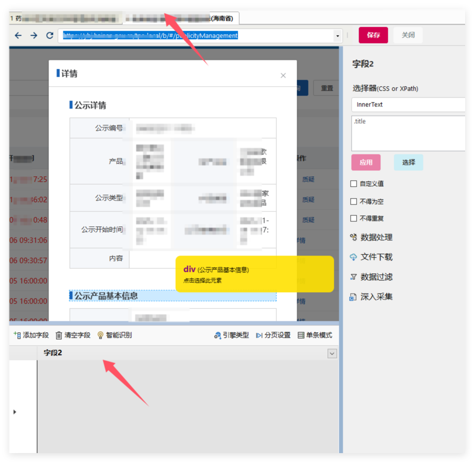
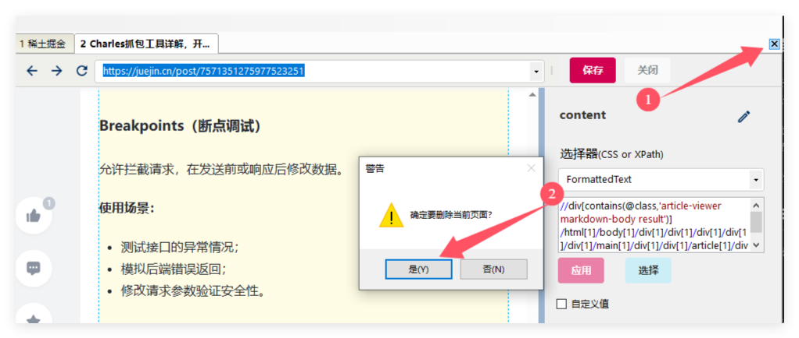

# 采集多级页面

## 一般情况

在[创建第一个任务](start.md)，演示了如何采集列表页数据。现在我们再深入一步，在采集列表的基础上，进一步采集内容页。

1. 在列表页面，**选中链接字段**
2. 点击**深入采集** 按钮

接着，会新建一个页面，采集器会自动检测页面类型。如果是文章类型的页面。软件会智能获取内容，自动创建一个 `content` 字段，取值属性为 FormattedText。

如果这个字段内容不是你想要的，可以删除字段。然后点击`添加字段`，在浏览器中点击需要的内容。

## 无链接但打开新标签

在一些网站中，在列表数据中没有链接字段，只有一个按钮，点击后会创建一个新的标签页。这种情况，我们需要先采集到这个按钮，然后选择改按钮字段，点击 **深入采集**

## 单页应用

在一些现代流行的Web框架中（比如Vue、React、Angular），在列表页面上，没有具体详情页面的链接地址。点击 查看详细 之类的按钮，会在当前页面会弹出一个窗口，用来展示详细数据。

和无连接的类似，先采集到这个按钮，然后选择改按钮字段，点击 **深入采集**，但是这里会多出一个操作，**设置弹窗的关闭按钮**，在第一级页面，我们选择 弹窗的关闭按钮。

在**切换到新增的二级页面**，**点击出详细窗口（需要手动点击出来）**。再添加字段，选择需要采集的数据。

## 手动构造采集链接

一般情况下

1. 新建字段，点击需要采集的链接。
2. 把[取值属性](attribute.md)修改为**href**

部分使用`javascript` 来跳转的链接需要我们手动组合链接地址( href值为空，或者类似`javascirpt:xxx()`)

## 删除页面

如何删除一个标签页？ 右击浏览器标签页的顶部，选择`删除此页面`。
        
