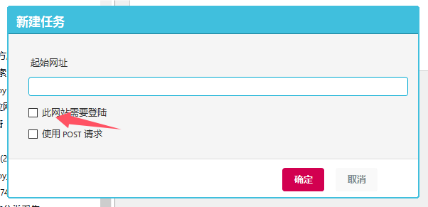
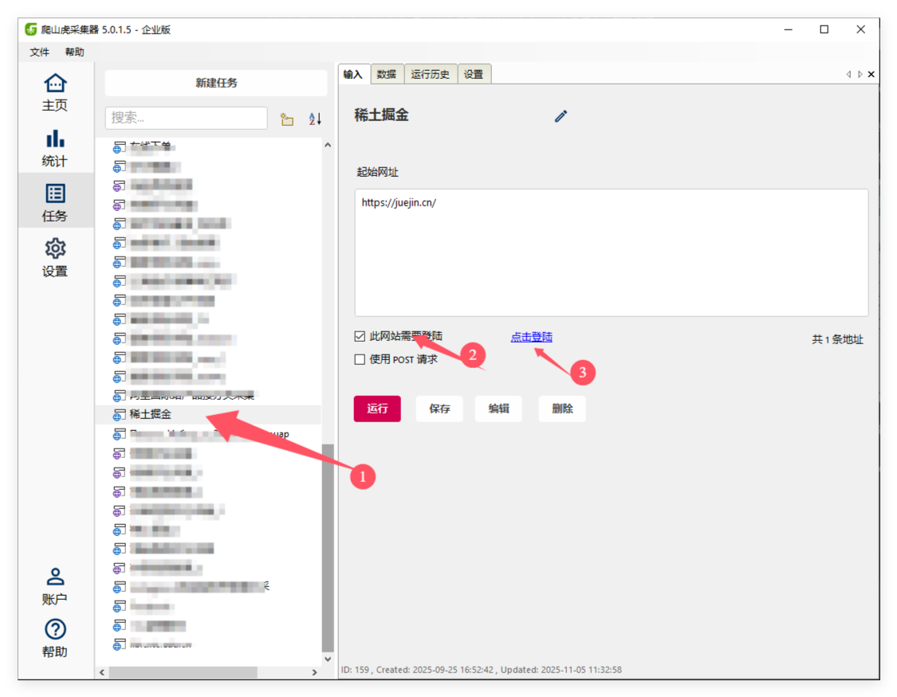

# 采集需要登陆的网站

## 新建任务
对于一些需要登录之后，才能看到数据内容的网站，要怎么采集呢？

在`新建任务`窗口，勾选左下角的`网站需要登录`。

然后`编辑器`窗口，完成登录操作即可。 登陆完成后，把网页地址切换到目标页面。

## 重新登陆

如果是已经创建的任务，长时间后网站的登陆信息（Cookie)会失效，需要重新登陆。在任务列表，选中任务，在右侧`输入`栏，点击`登陆网站`。在弹出的窗口，完成登陆。

