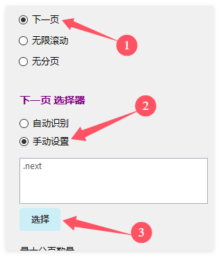
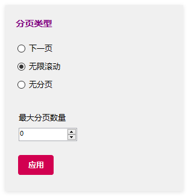
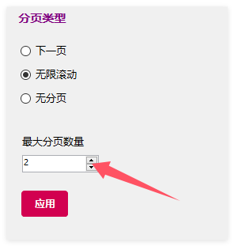

# 分页设置

通常，列表页都会有分页，如何采集分页中的数据呢？在现代的Web互联网，主要分为2种，下一页分页和无限滚动。

## 下一页分页

下一页分页是最经典的分页方式，在列表底部显示页码（1, 2, 3, …, 10, 下一页 >）。针对这种形式的页面，在采集器中可以选择2种方式。

* **自动识别**
    
    爬山虎采集器可以识别90%的分页元素，通过选择`下一页`->`自动识别` 。

* **手动设置分页**

    当不能自动识别时，我们就需要手动设置分页。如何手动设置分页？
    1. 首先选择`分页设置`->`手动设置分页` ，
    2. 在点击`选择`，在浏览器中找到`下一页`元素并点击。
    

## 无限滚动

无限滚动是社交媒体的常用分页形式。你往下拉，内容就自动加载。微博、抖音、今日头条Facebook、TikTok，都用这种方式，又称 瀑布流分页 。

这类型网页，直接选择**无限滚动**。 采集器会自动滚到网页，直到分页完成。

##  加载更多形式

有些网站会使用**加载更多**、**More** 这样的按钮，点击才会展示更多数据。 采集这种类型的页面，我们需要**手动设置分页**, 把**加载更多**当作下一页按钮来设置。

## 设置采集最大分页

可以设置要采集的最大分页数量。这在更新采集时，非常必要。比如每天网站更新的内容都在前3页中，我们就可以设置最大分页为3页。 
默认值是0，表示不限制，一直采集直到完成。

