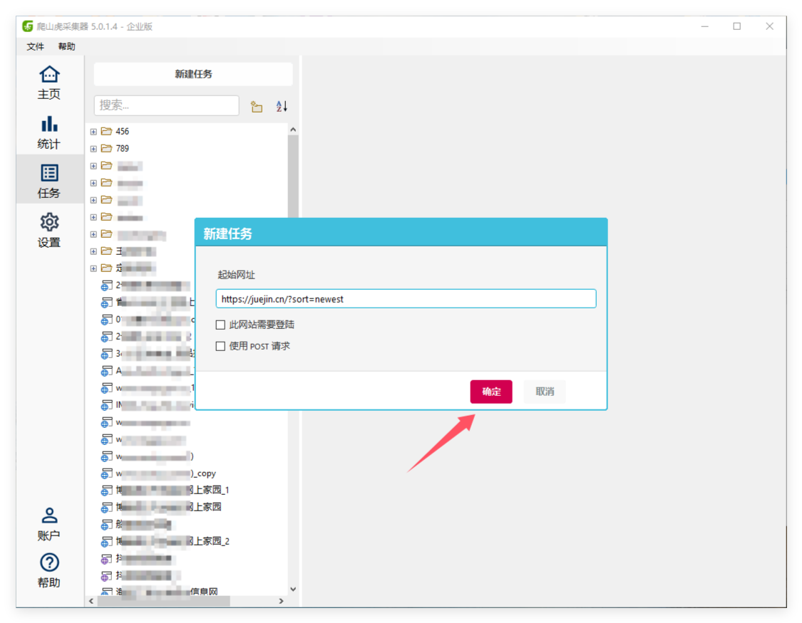
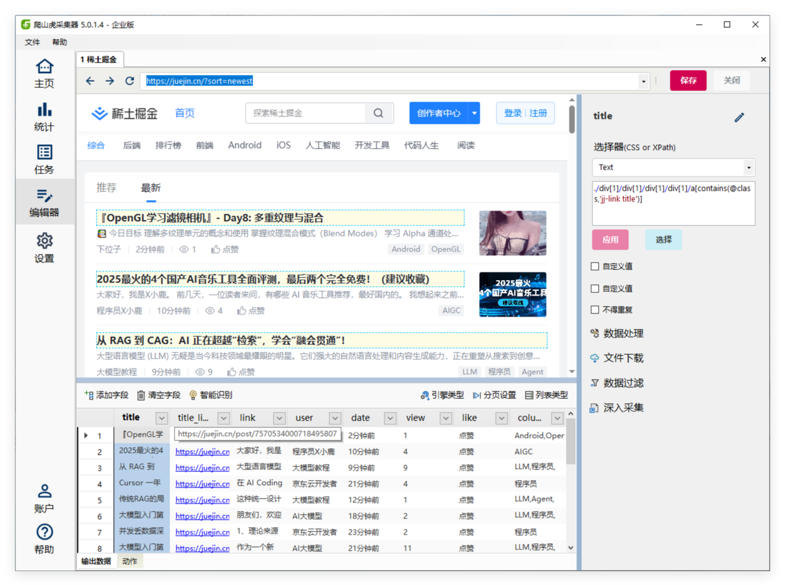
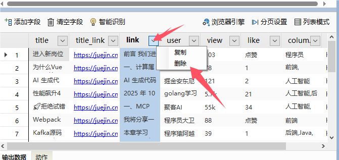
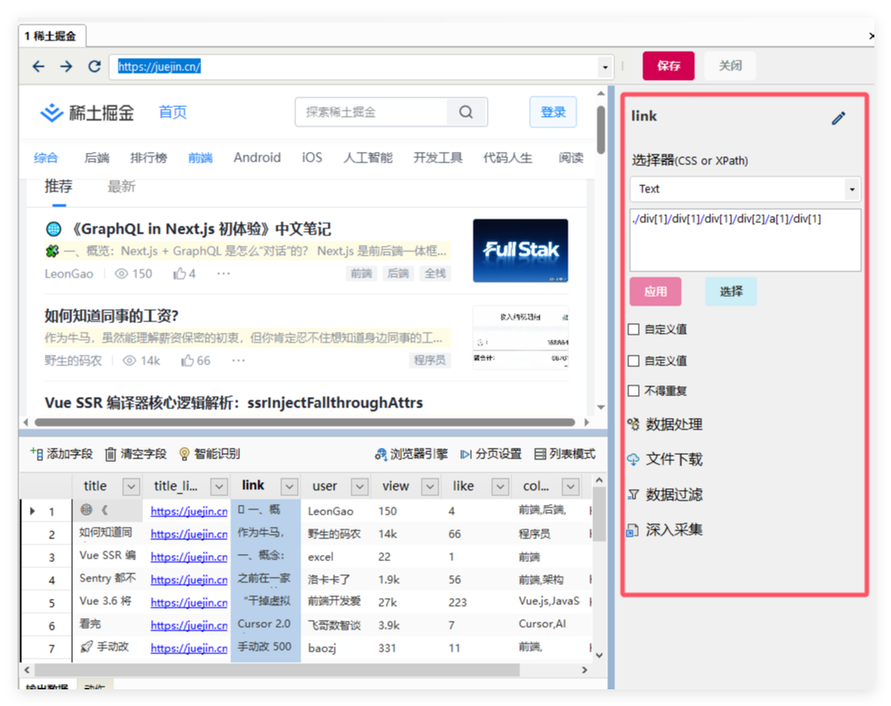
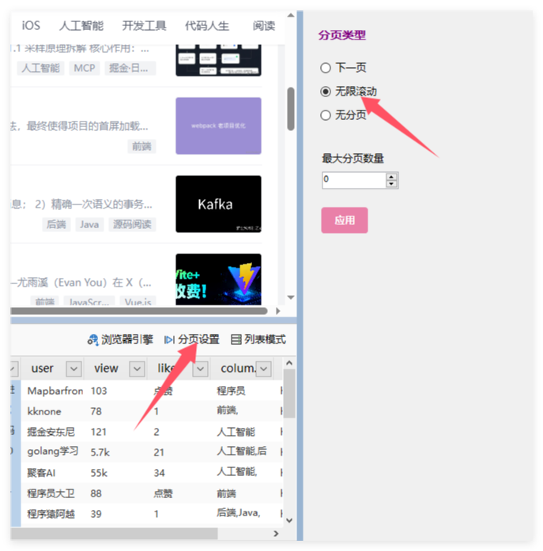
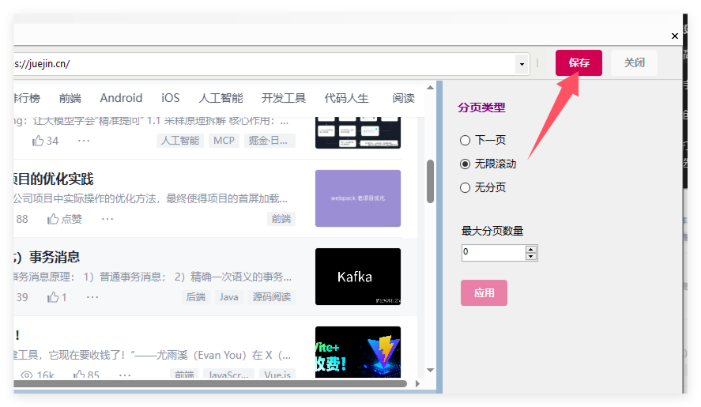
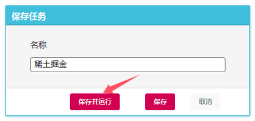
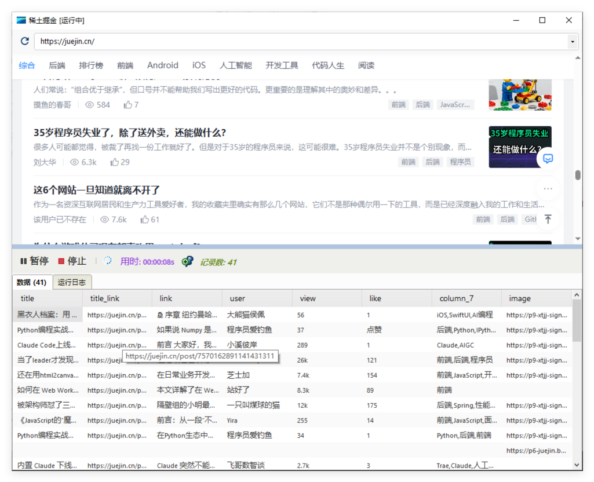
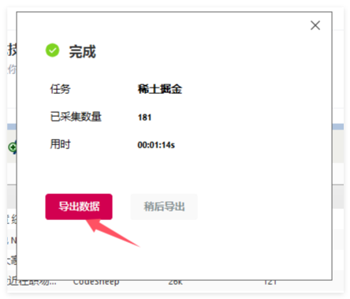

# 创建第一个任务
##  第一步：选择起始网址

在开始采集网站数据前，首先需要确定一个展示数据列表的网页地址。

以 [掘金网](https://juejin.cn/) 为例，我们找到网站的最新文章页面地址：   [https://juejin.cn/?sort=newest](https://juejin.cn/?sort=newest)

在 **爬山虎采集器** 中，选择 **任务**栏：
1. 点击 `新建任务`；
2. 此时弹出 `新建任务窗口`
3. 在 `起始网址` 文本框，输入网址 https://juejin.cn/?sort=newest。

完成后，点击 **确定** 继续。

##  第二步：抓取数据

点击确定后，软件会进入**编辑器**，软件会自动分析网页结构，并智能提取出页面中的数据列表，如下所示：

此时，可以对已识别的数据列进行调整，例如删除不需要的字段。  
点击列名右侧的下拉菜单，选择 **删除字段**。

选中字段，可以进行以下操作：

-  **修改字段名称**
-  **设置选择器（css 或 XPath）**
-  **数据处理**

> 以上高级操作将在后续章节中详细介绍。

整理完字段后，接下来配置 **分页设置**：

在首次创建任务时，采集器会自动检测网页的分页类型，比如`无限滚轮分页`、`下一页`分页。

1. 打开 **分页设置**；
2. 选择 **无限滚动**；

完成设置后，点击 **保存**。在保存窗口，点击 **保存并运行**

##  第三步：运行任务

程序将自动打开浏览器、加载页面并开始采集数据。

  
等待任务执行完成后，即可在结果面板中查看采集数据或导出为 CSV/Excel 文件。

**至此，你已成功创建并运行了一个完整的采集任务！**  
后续章节将进一步介绍字段处理、数据导出与自动化采集的进阶功能。
