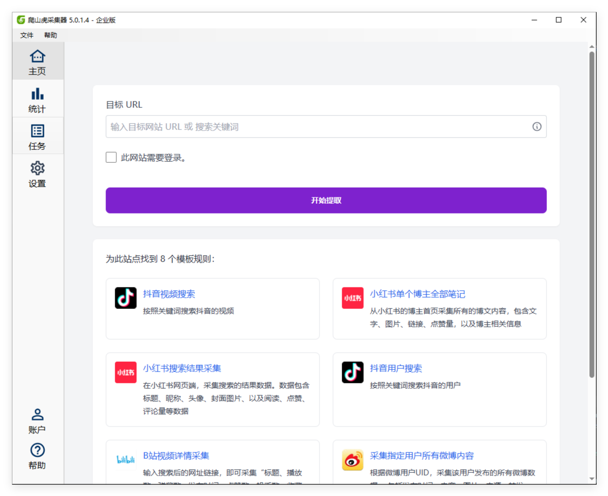
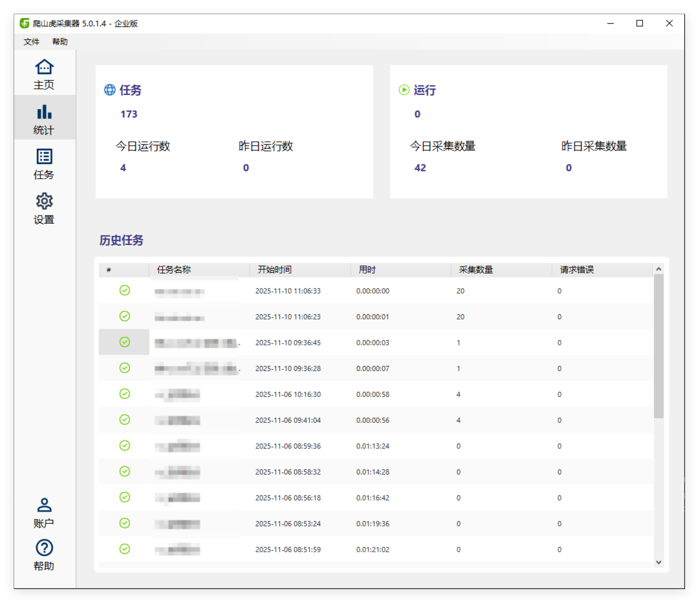
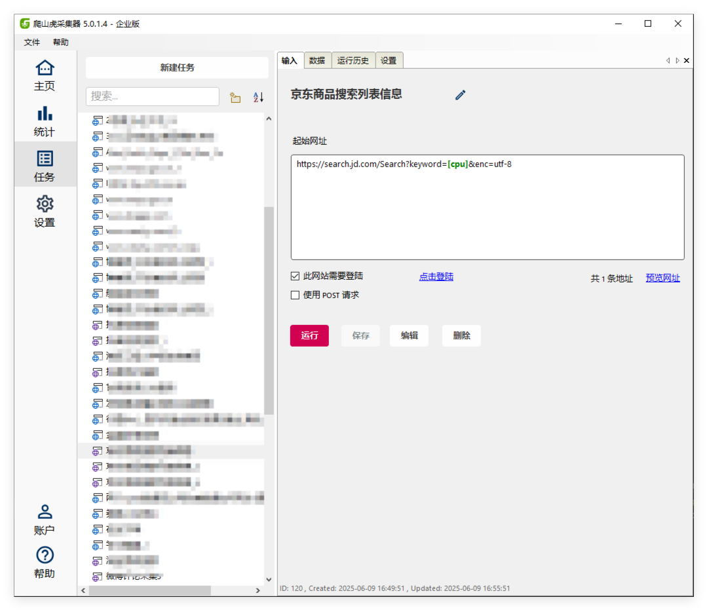
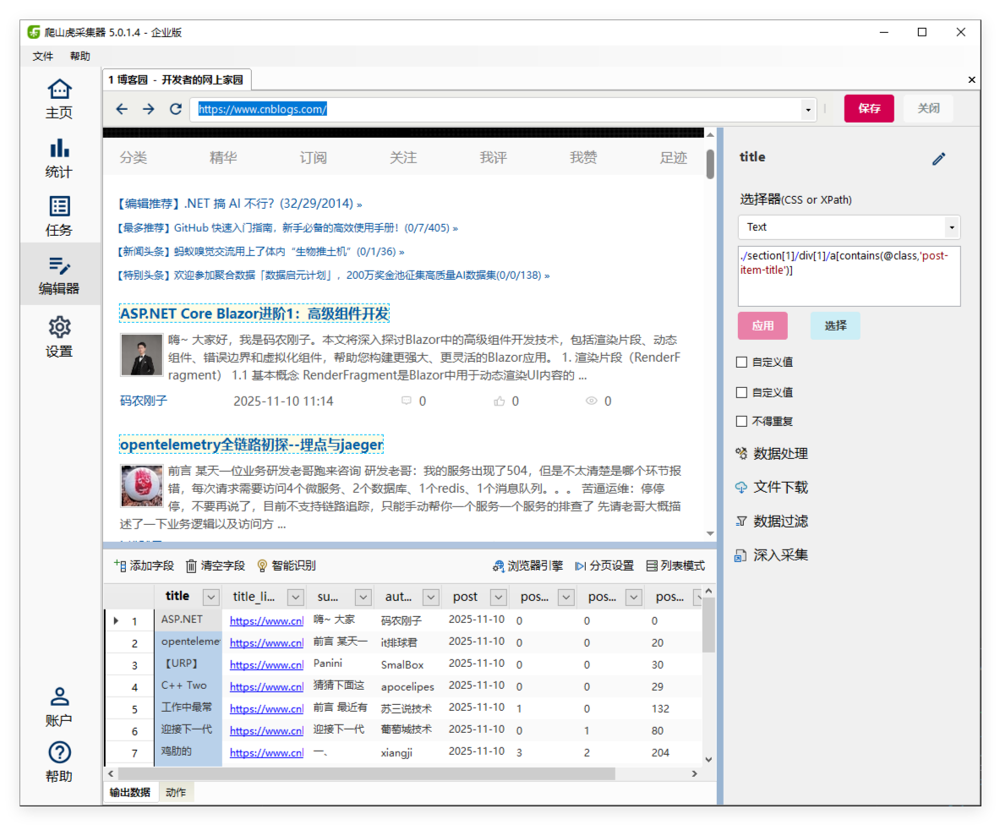

下面介绍下爬山虎采集器的主要功能界面。

## 主页界面

爬山虎采集器的主页界面，也是开始页面，此页面展示了软件内置了主流网站的采集规则。我们通过输入关键词、网址来查找是否有可用的规则。如果没有可以直接点击开始采集。

## 统计界面 

统计界面，展示了任务运行的一些统计数据。包括今天、昨天已经运行的任务数量、采集数据量。已经运行的具体任务历史记录

## 任务管理界面

任务管理界面，包含了已经创建的所有分组、任务。可以在这里新建任务、对任务设置、管理已经采集数据、查看单个任务的历史运行记录以及高级设置。

## 任务编辑器 

任务编辑器是对采集任务进行具体的设置，包括新建、修改字段信息，增加、删除页面，对字段数据进行数据处理、过滤、下载等设置。

