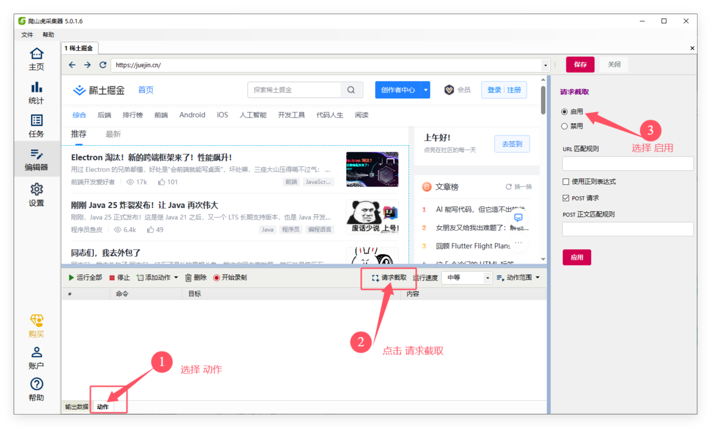
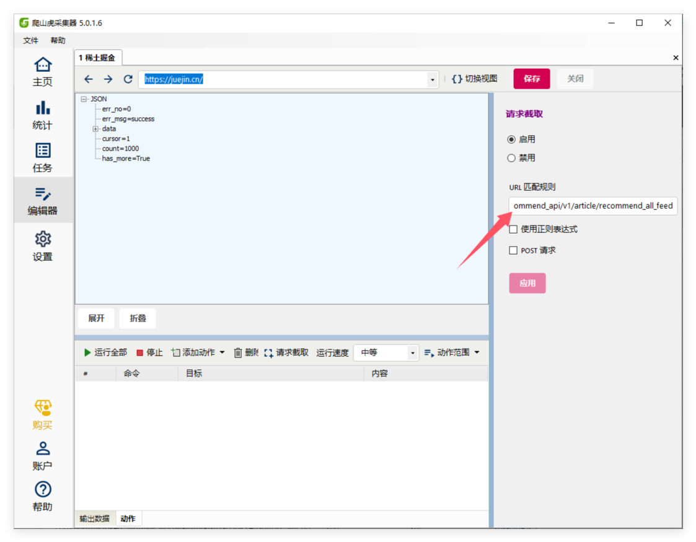
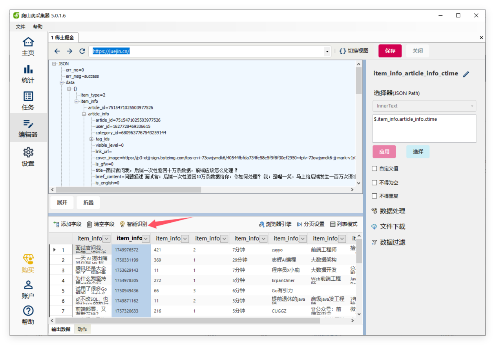
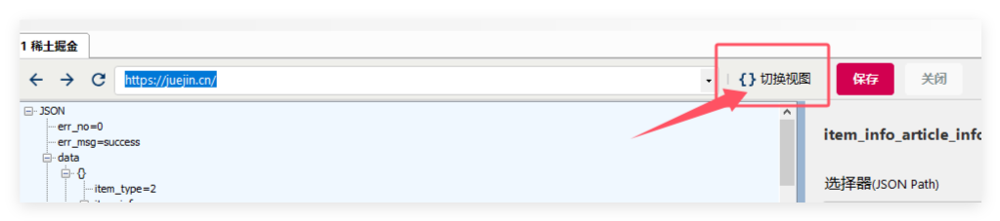

# 请求截取

## 使用场景

当我们在采集一些网站时，有些数据是通过AJAX请求动态获取的，并且在请求时，参数中加入了签名参数，这使得我们无法通过模拟请求获取数据。这种情况下我们可以使用**请求截取**，通过设置指定请求的url特征，捕获浏览器请求的结果。

## 如何使用

1. 在编辑器界面，选择 **动作** ，点击 **请求截取** 按钮。

1. 在请求截取窗口，勾选`启用`，输入需要截取的AJAX请求URL规则。 软件根据这个URL规则来查找请求。如果请求是POST形式，可以勾选`POST请求`。对于一些复杂的url，可以通过正则匹配。

2. 完成后，点击`刷新`，来触发浏览器发出AJAX请求。 

3. 当捕获到请求后，软件会自动切换到JSON视图，显示截取到的请求数据。

这里可以使用`智能识别` ，来自动识别JSON数据。

## 分页

设置分页和普通页面的分页是一样的，通过点击 **切换视图** ，切换到浏览器界面，然后设置相应的分页。可以是 无限滚动 或 下一页 类型

